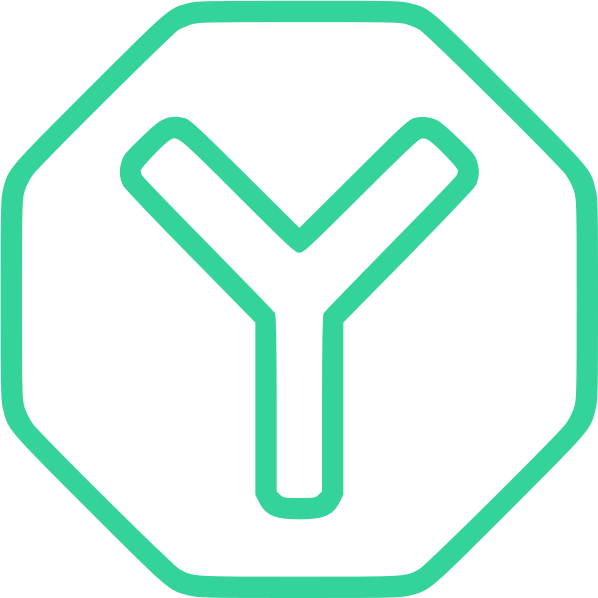

<p align="center">
  
</p>

# UI-Kit Yesterdays

**Версия:** 0.0.1

ui-kit-yesterdays — это UI-компонентный набор для Vue 3, который позволяет быстро и удобно создавать интерфейсы. Данный набор включает набор готовых компонентов, стили и утилиты, позволяющие существенно ускорить разработку и стандартизировать дизайн вашего приложения.

## Содержание

- [Установка](#установка)
- [Подключение](#подключение)
- [Использование](#использование)
- [Лицензия](#лицензия)

## Установка

Для установки воспользуйтесь командой:

``` bash
npm i ui-kit-yesterdays
```

## Подключение

Для использования подключите её глобально со стилями с корне проекта

``` ts
import { createApp } from 'vue';
import App from '@/App.vue';
import UiKitYesterdays from 'ui-kit-yesterdays';
import 'ui-kit-yesterdays/dist/ui-kit-yesterdays.css';

const app = createApp(App);

app.use(UiKitYesterdays).mount('#app');
```

## Использование

По скольку компоненты зарегистрированы глобально их не надо импортировать

``` vue
<template>
  <div>
    <y-double-card>
      <template #front>
        <FromAuthorization />
      </template>
      <template #back>
        <FormRegistration />
      </template>
    </y-double-card>
  </div>
</template>

<script setup>
import FromAuthorization from '@/components/auth-page/from-authorization.vue';
import FormRegistration from '@/components/auth-page/form-registration.vue';
</script>
```

## Лицензия

Её нет 😥